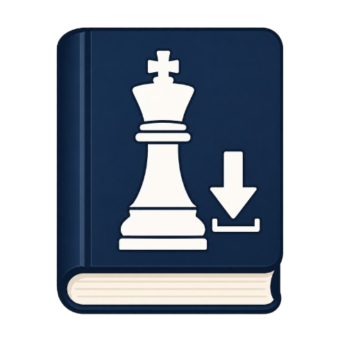

  

<h1 align="center">Chess Book Diagram Extractor</h1>

  Extraia automaticamente diagramas 8×8 de livros de xadrez em PDF.

  

O **Chess Book Diagram Extractor** é um aplicativo gratuito para Windows que
localiza automaticamente diagramas de tabuleiros em livros de xadrez. Ele gera
um novo PDF A4 com um diagrama centralizado por página, pronto para imprimir,
organizar ou estudar.

## Principais recursos

- Detecta páginas com zero, um ou vários diagramas.
- Recorta as 64 casas, as peças e a borda imediata do tabuleiro.
- Corrige pequenas inclinações e elimina detecções duplicadas.
- Filtra ilustrações, peças isoladas e outros falsos positivos comuns.
- Preserva a ordem em que os diagramas aparecem no livro.
- Cria um PDF A4 branco com um diagrama centralizado por página.
- Informa abaixo de cada diagrama a página original e a confiança da detecção.
- Recupera candidatos de menor confiança em livros que alternam páginas com
  dois diagramas e páginas de texto.
- Sugere localmente a posição das peças em notação Forsyth portuguesa.
- Permite escolher a notação das peças em português ou inglês.
- Permite visualizar e, opcionalmente, editar as posições antes de salvar no PDF.
- Compara casas ambíguas com peças confiáveis encontradas no mesmo livro,
  sempre respeitando a cor clara ou escura da casa.
- Aprende com edições feitas na notação daquele PDF e preserva essas referências
  localmente para execuções futuras.
- Permite marcar um recorte como **Não é um tabuleiro/diagrama**, removendo-o do
  PDF revisado e da lista final de posições.
- Salva automaticamente um rascunho da revisão para continuar depois.
- Mantém uma biblioteca interna dos livros processados, independente da cópia
  de PDF exportada, para reabrir e editar as posições posteriormente.
- Permite definir o lado a jogar e o `Annotator` e exportar uma entrada PGN por
  diagrama, com as tags `SetUp` e `FEN` completas.
- Permite cancelar com segurança a detecção, o reconhecimento ou a geração do PDF.
- Verifica novas versões e valida o SHA-256 antes de atualizar.
- Inclui desinstalador e não exige Python ou bibliotecas adicionais.

## Baixar e instalar

1. Clique no botão **Baixar para Windows** no início desta página.
2. Execute `ChessBookDiagramExtractor-Setup.exe`.
3. Siga as instruções do instalador.
4. Abra **Chess Book Diagram Extractor** pelo menu Iniciar.

O aplicativo é compatível com Windows 10 e Windows 11 de 64 bits e é instalado
somente para o usuário atual.

> Enquanto o projeto não possuir um certificado de assinatura de código, o
> Windows SmartScreen poderá mostrar um aviso na primeira execução do
> instalador.

## Como usar

1. Clique em **Selecionar PDF** e escolha o livro.
2. O aplicativo sugere automaticamente um arquivo com o sufixo `_diagramas.pdf`.
3. Se necessário, clique em **Alterar** para escolher outro local de saída.
4. Mantenha **Incluir notação Forsyth** marcada para reconhecer a posição das
   peças, ou desmarque-a para usar o fluxo simples.
5. Escolha se a notação das peças será em **Português** ou **Inglês**.
6. Marque ou desmarque **Abrir o PDF ao concluir**.
7. Clique em **Extrair diagramas**. O PDF das extrações é salvo primeiro.
8. Se a notação estiver ativa, o aplicativo relê esse PDF e abre a janela de
   visualização. Use **Primeiro**, **Anterior**, **Próximo** e **Último** para navegar.
9. Confira os avisos de revisão automática. Se um recorte não for um tabuleiro,
   marque a opção correspondente para excluí-lo do resultado final.
10. Clique em **Salvar notações no PDF**. Toda sugestão com sintaxe válida aparecerá como
    texto selecionável acima do diagrama, e as posições também serão listadas ao final.
11. Ao terminar, use **Abrir PDF** ou **Abrir pasta**.
12. Para voltar a um livro, selecione-o na biblioteca abaixo de **Extrair
    diagramas** e clique em **Visualizar selecionado**. No visualizador, escolha
    **White to Move** ou **Black to Move**, revise as posições e use **Exportar
    PGN** quando desejar. O nome do `Annotator` será solicitado durante a
    exportação.

Na biblioteca, use **Renomear** para alterar o nome interno e **Excluir** para
remover apenas a cópia permanente do aplicativo. `F2`, `Delete` e `Enter`
acionam, respectivamente, renomear, excluir e visualizar. Se uma extração ou
renomeação repetir o nome de outro livro, o aplicativo solicita confirmação
antes de substituir o conjunto de diagramas existente.

O PDF escolhido durante a extração é uma cópia exportada. A biblioteca mantém
uma cópia interna própria, portanto o livro continua disponível no aplicativo
mesmo que o arquivo exportado seja movido ou excluído.

Na notação portuguesa, `R/D/T/B/C/P` representam rei, dama, torre, bispo,
cavalo e peão brancos. Na opção inglesa, são usadas as letras tradicionais
`K/Q/R/B/N/P`. Em ambos os casos, letras minúsculas representam as peças pretas. A
sugestão é automática e pode errar em diagramas antigos ou degradados, por isso
o aplicativo sempre oferece a visualização antes de gerar o documento anotado.

O livro original nunca é alterado.

## Atualizações automáticas

Ao iniciar, o aplicativo consulta a versão mais recente publicada neste
repositório. Quando houver uma atualização, ele solicita confirmação antes de
baixar e instalar qualquer arquivo. O instalador baixado só é executado após a
validação de seu hash SHA-256.

Também é possível abrir o menu no canto superior direito e escolher
**Verificar atualizações**.

## Como desinstalar

Use uma destas opções do Windows:

- abra **Desinstalar Chess Book Diagram Extractor** no menu Iniciar; ou
- acesse **Configurações > Aplicativos > Aplicativos instalados**.

O Editor exibido pelo Windows é **E-Lopes**.

## Segurança e privacidade

O processamento dos livros acontece localmente no computador. O arquivo PDF
não é enviado para servidores externos. O reconhecimento Forsyth também usa
um modelo incluído no aplicativo e funciona localmente. A internet é usada
somente para verificar e baixar atualizações.

Consulte a [Política de Privacidade](PRIVACY.md) e a
[Política de assinatura de código](CODE_SIGNING_POLICY.md).

O projeto solicitou a assinatura gratuita fornecida por
[SignPath.io](https://signpath.io/), com certificado da
[SignPath Foundation](https://signpath.org/). Versões publicadas antes da
conclusão dessa integração podem não possuir assinatura digital.

> Free code signing provided by SignPath.io, certificate by SignPath Foundation.

## Limitações conhecidas

A detecção visual foi desenvolvida para tabuleiros convencionais 8×8 com
resolução legível. Diagramas muito degradados ou elementos gráficos que imitam
fortemente uma grade 8×8 ainda podem produzir falsos positivos.

O reconhecimento de posições usa o modelo do projeto
[fenshot](https://github.com/scoriiu/fenshot), distribuído sob a licença MIT.
Consulte os [avisos de terceiros](THIRD_PARTY_NOTICES.md).

## Documentação técnica

Para entender a arquitetura, os algoritmos de detecção e Forsyth, o processo de
distribuição no Windows, os testes e os motivos das principais escolhas,
consulte a [documentação técnica do projeto](docs/README.md).

---

  Desenvolvido e publicado por <strong>E-Lopes</strong> · Licença MIT

