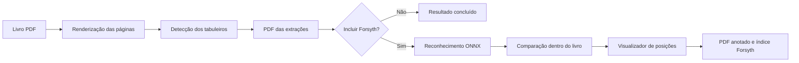

# Documentação técnica

Esta documentação descreve como o **Chess Book Diagram Extractor** funciona
internamente e registra as principais decisões tomadas durante seu
desenvolvimento. O [README principal](../README.md) continua sendo o guia de
instalação e uso para o público final.

## Visão geral do sistema

O aplicativo recebe um livro em PDF, localiza tabuleiros 8×8, gera um primeiro
PDF apenas com os recortes e, quando solicitado, reconhece e apresenta as
posições em notação Forsyth antes de produzir o documento anotado.

O PDF original nunca é modificado. O processamento visual e o reconhecimento
das peças são locais; a rede é usada somente pelo atualizador.

## Guias

- [Arquitetura](ARQUITETURA.md): módulos, fluxo de execução, threads,
  persistência e tratamento de erros.
- [Algoritmos](ALGORITMOS.md): detecção 8×8, reconhecimento Forsyth e revisão
  automática baseada nas peças do próprio livro.
- [Distribuição para Windows](DISTRIBUICAO_WINDOWS.md): dependências, build,
  instalador, releases, atualizações e assinatura.
- [Testes e qualidade](TESTES.md): cobertura automatizada, fixtures, integração
  sintética e validações antes de publicar.
- [Decisões técnicas](DECISOES_TECNICAS.md): contexto, alternativas e
  consequências das escolhas mais importantes.

## Mapa do repositório

| Caminho | Responsabilidade |
|---|---|
| `interface_windows.py` | Janela principal, coordenação das tarefas e atualização da interface |
| `extrair_tabuleiros_pdf.py` | Renderização, detecção, recorte e geração dos PDFs |
| `notacao_forsyth.py` | Notação, inferência ONNX, revisão automática e persistência |
| `revisor_forsyth.py` | Visualizador e edição opcional das posições reconhecidas |
| `autoupdate.py` | Consulta, download, validação e início de uma atualização |
| `version.py` | Versão e identificação do repositório |
| `models/` | Modelo ONNX distribuído com o aplicativo |
| `icon/` | Ícones usados na janela, executável, instalador e README |
| `packaging/` | Metadados de versão, ícone e script do Inno Setup |
| `tests/` | Testes automatizados e fixtures públicas |
| `.github/workflows/` | Build e publicação automatizados no GitHub Actions |

## Princípios do projeto

- O livro permanece no computador do usuário.
- Perder um tabuleiro é mais prejudicial que apresentar um candidato extra que
  possa ser excluído no visualizador.
- Uma correção automática de peça só é aceita com evidência forte; na dúvida,
  a classificação original é preservada.
- A interface nunca deve ficar bloqueada por processamento pesado.
- Arquivos finais e rascunhos importantes são gravados de forma atômica sempre
  que possível.
- O instalador deve funcionar em Windows 10 e 11 de 64 bits sem exigir uma
  instalação prévia de Python.
